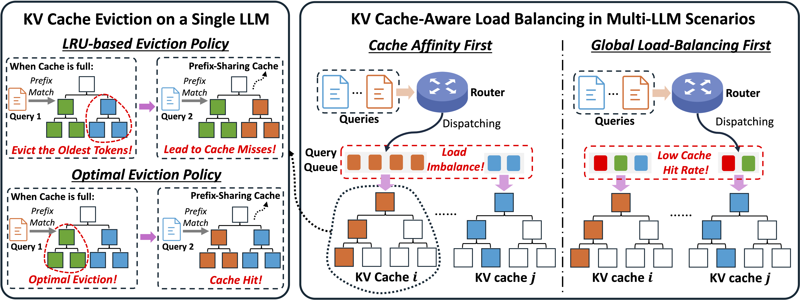

# Randomization Boosts KV Caching, Learning Balances Query Load: A Joint Perspective

 

## Introduction
KV caching is a fundamental technique for accelerating Large Language Model (LLM) inference by reusing key-value (KV) pairs from previous queries, but its effectiveness under limited memory is highly sensitive to the eviction policy. The default Least Recently Used (LRU) eviction algorithm struggles with dynamic online query arrivals, especially in multi-LLM serving scenarios, where balancing query load across workers and maximizing cache hit rate of each worker are inherently conflicting objectives. We give the first unified mathematical model that captures the core trade-offs between KV cache eviction and query routing. Our analysis reveals the theoretical limitations of existing methods and leads to principled algorithms that integrate provably competitive randomized KV cache eviction with learning-based methods to adaptively route queries with evolving patterns, thus balancing query load and cache hit rate. Our theoretical results are validated by extensive experiments across 4 benchmarks and 3 prefix-sharing settings, demonstrating improvements of up to **6.92×** in cache hit rate, **11.96×** reduction in latency, **14.06×** reduction in time-to-first-token (TTFT), and **77.4\%** increase in throughput over the state-of-the-art methods.



## Updates
- [2026.1.26] 🚀 Our code is released!

## Setup
Compile and install sglang and the router:
```bash
cd kvcode_sup
bash run_build.sh
```

Authenticate with hugging face token:
```bash
huggingface-cli login
```

## Run Evaluation
### GSP Benchmark

To reproduce the results on Llama-3.1-8B-Instruct, run:
```bash
bash gsp.sh \
    "meta-llama/Llama-3.1-8B-Instruct"  "Llama-3.1-8B-Instruct" \
    "None"  "None"  "4" \
    "random"    "<Routing algorithm choice>"    "<Eviction algorithm choice>" \
    "128"   "32"    "0.5"   "512-1024-2048-4096-8192"   \
    "4" "12"
```
#### Arguments
* `MODEL_TAG`
  Model identifier/path for SGLang to load, e.g. `meta-llama/Llama-3.1-8B-Instruct`

* `MODEL_SAFE`
  Safe model name used in filenames, e.g. `Llama-3.1-8B-Instruct`

* `MAX_REQ`
  Max running requests per worker. Use `None` to set as default

* `MEM_FRAC`
  KV cache memory fraction per worker. Use `None` to set as default

* `NGPUS`
  Number of workers (and GPUs), e.g. `4`. (By default, we use 4 L40 for Llama 8B, and 4 H200 GPUs for Llama-70B and Mixtral-8x7B) 

* `ORDER`
  GSP query order, e.g. `random`.

* `POLICY`
  Router policy, e.g. `cache_aware` for cache aware routing, `eta_online_3d` for LBGR, `random` for random routing, and `round_robin` for round robin routing

* `RLT`
  Binary to enable RLT on workers, `1` for `RLT`, `0` for `L-LRU`

* `GRP`
  Number of GSP groups, e.g. `128`

* `PG`
  Prompts per group, e.g. `32`

* `PRATIO`
  Shared prefix ratio in [0,1], e.g. `0.5`

* `OUTPUT_LEN`
    Output token length, e.g. `4`

* `RATE`
    Request rate (QPS), e.g. `12`


### ShareGPT Benchmark
#### Dataset Download
Download the dataset using `./sglang-0.4.6/benchmark/hicache/download.sh` and specify the data file name as `sharegpt.json`.

To reproduce the results on Llama-3.1-8B-Instruct, run:
```bash
bash multi_conv.sh \
    "meta-llama/Llama-3.1-8B-Instruct"  "Llama-3.1-8B-Instruct" \
    "None"  "None"  "4" \
    "random"    "<Routing algorithm choice>"    "<Eviction algorithm choice>" \
    "128"   "sharegpt"   "1024"   \
    "4" "12"
```


### UltraChat Benchmark
#### Dataset Download
Download the dataset using `./sglang-0.4.6/benchmark/hicache/download.sh` and specify the data file name as `ultrachat.json`.

To reproduce the results on Llama-3.1-8B-Instruct, run:
```bash
bash multi_conv.sh \
    "meta-llama/Llama-3.1-8B-Instruct"  "Llama-3.1-8B-Instruct" \
    "None"  "None"  "4" \
    "random"    "<Routing algorithm choice>"    "<Eviction algorithm choice>" \
    "128"   "ultrachat"   "1024"   \
    "4" "12"
```


### Loogle Benchmark
Download the dataset using `./sglang-0.4.6/benchmark/hicache/download.sh` and specify the data file name as `loogle.jsonl`.

To reproduce the results on Llama-3.1-8B-Instruct, run:
```bash
bash long.sh \
    "meta-llama/Llama-3.1-8B-Instruct"  "Llama-3.1-8B-Instruct" \
    "None"  "None"  "4" \
    "random"   "<Routing algorithm choice>"    "<Eviction algorithm choice>" \
    "512"   "4" "12" \
    "loogle.jsonl"
```

## Citation

If you use this codebase, please consider citing our paper:

```bibtex
@inproceedings{
wu2026randomization,
title={Randomization Boosts {KV} Caching, Learning Balances Query Load: A Joint Perspective},
author={Fangzhou Wu and Sandeep Silwal and Qiuyi Zhang},
booktitle={The Fourteenth International Conference on Learning Representations},
year={2026},
url={https://openreview.net/forum?id=R7fv5NWfMm}
}
```